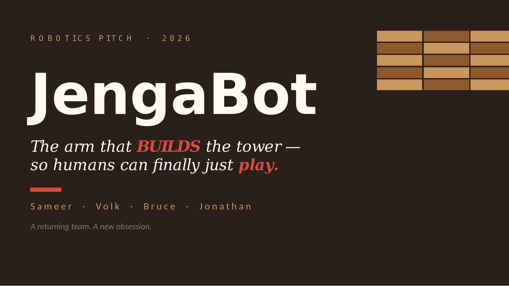
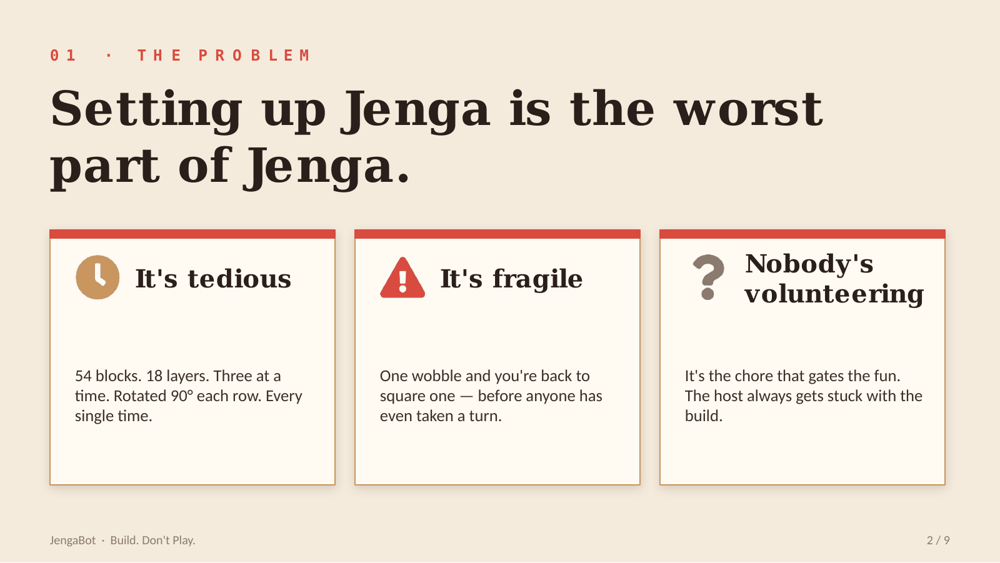
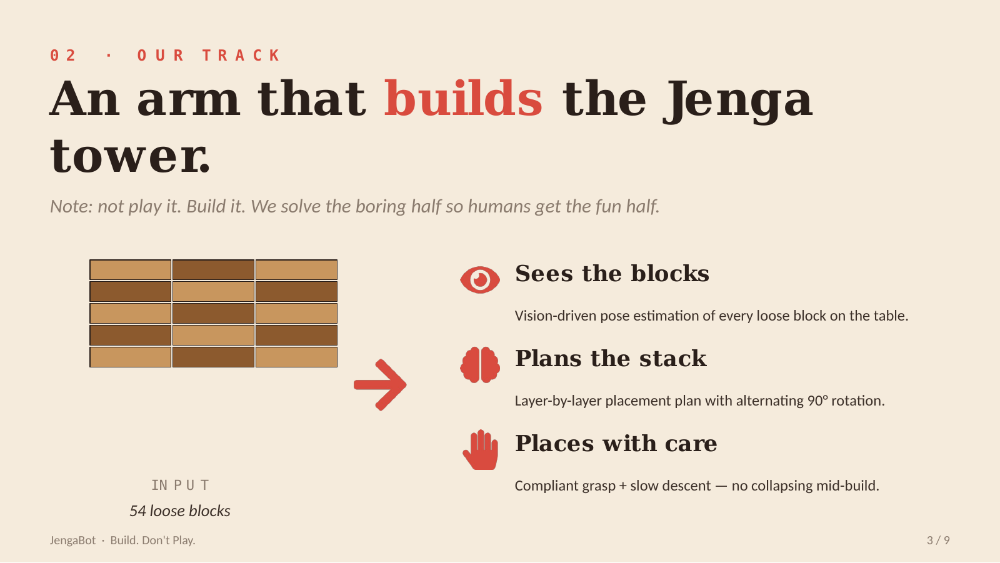
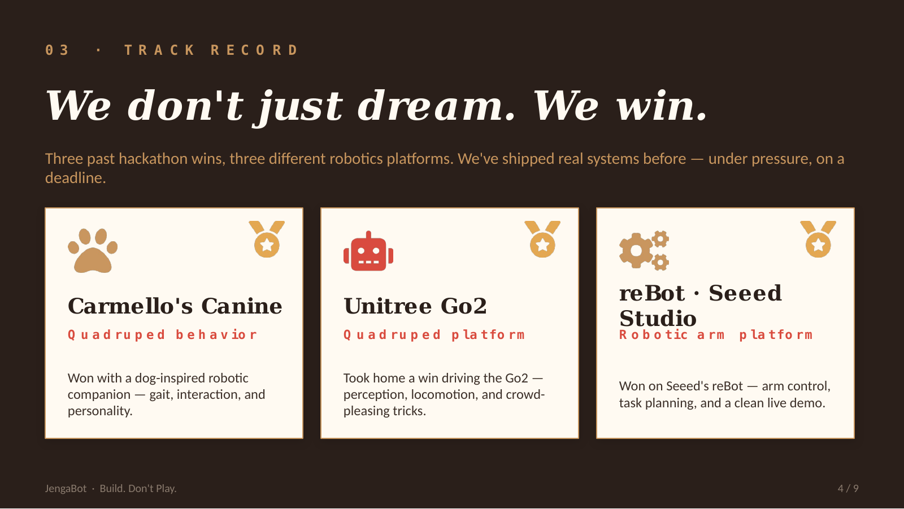
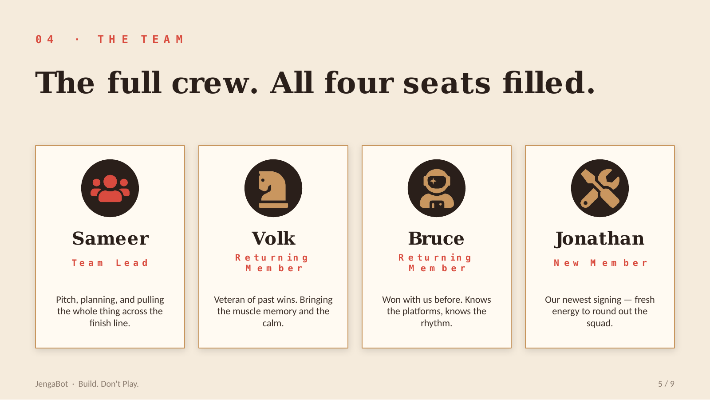
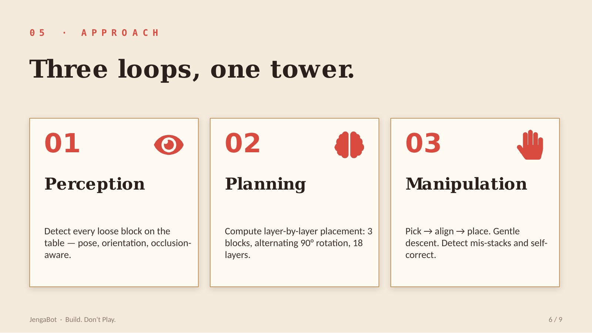
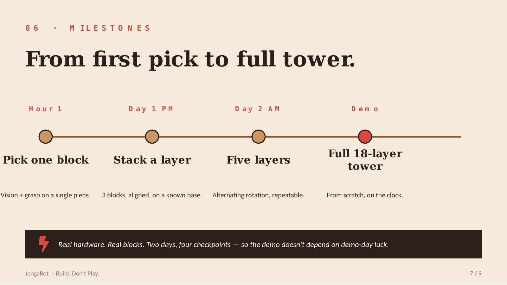
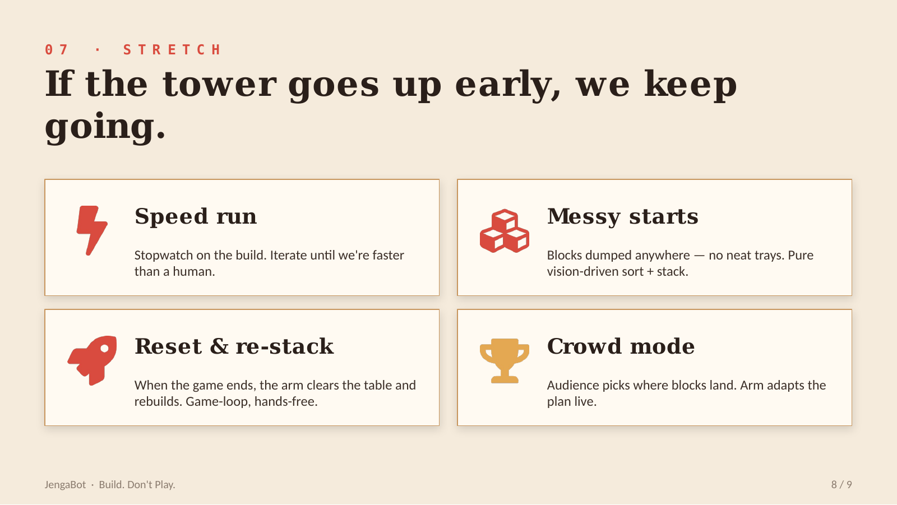
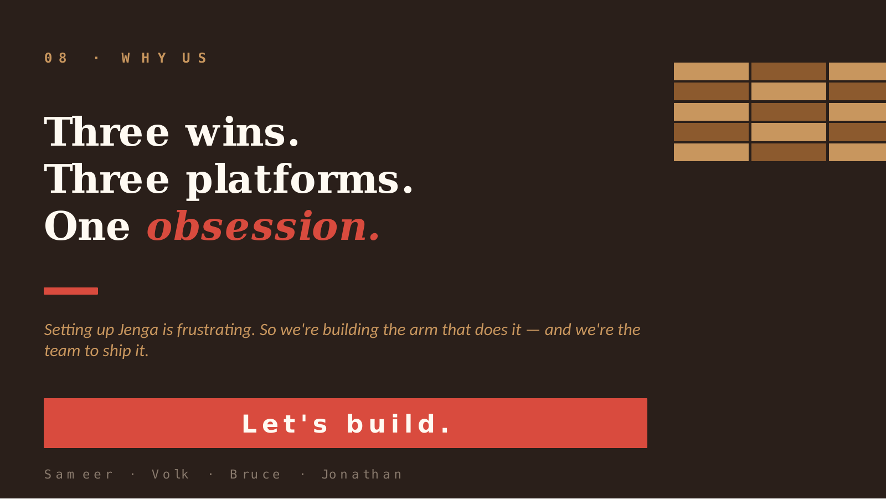

# JengaBot

> **The arm that BUILDS the tower — so humans can finally just play.**

A robotics pitch deck. We're building a robotic arm that sets up Jenga (not plays it), because setting up Jenga is the worst part of Jenga.

**Team:** Sameer · Volk · Bruce · Jonathan

---

## The deck

All slides render inline below — no PowerPoint required to view.

### 1. Title

### 2. The Problem

### 3. Our Track

### 4. Track Record

### 5. The Team

### 6. Approach

### 7. Milestones

### 8. Stretch Goals

### 9. Why Us

---

## Downloads

- [JengaBot_Pitch.pptx](JengaBot_Pitch.pptx) — editable PowerPoint
- [JengaBot_Pitch.pdf](JengaBot_Pitch.pdf) — printable PDF

---

## Track record

| Project | Platform | What we did |
|---|---|---|
| **Carmello's Canine** | Quadruped | Dog-inspired robotic companion — gait, interaction, and personality |
| **Unitree Go2** | Quadruped | Perception, locomotion, and crowd-pleasing tricks |
| **reBot · Seeed Studio** | Robotic arm | Arm control, task planning, clean live demo |

Three platforms. Three wins. One obsession.
